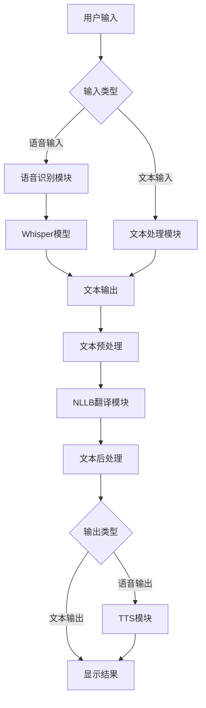
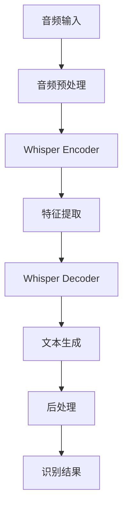
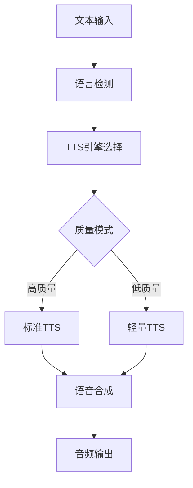
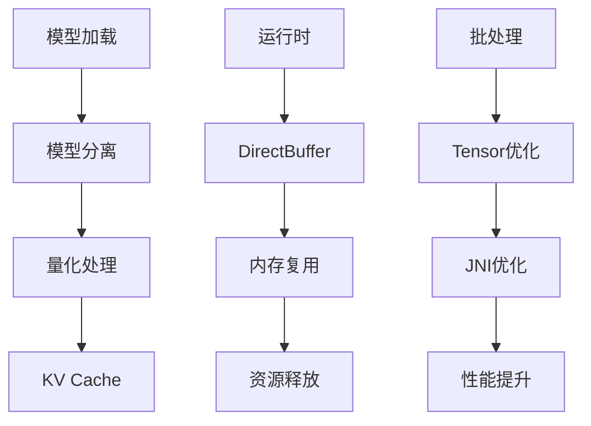

# RTranslator 技术实现文档

## 0. 系统流程图

### 0.1 整体架构流程


### 0.2 语音识别流程


### 0.3 翻译流程
```mermaid
graph TD
    A[输入文本] --> B1[文本预处理]
    B1 --> B2[长文本分段]
    B2 --> B3[SentencePiece分词]
    B3 --> B4[添加语言标识符]
    B4 --> B5[转换为input_ids]
    
    subgraph Encoder处理
        C1[NLLB Encoder] --> C2[创建attention_mask]
        C2 --> C3[执行encoder推理]
        C3 --> C4[生成encoder_hidden_states]
    end
    
    B5 --> C1
    
    subgraph KV Cache处理
        D1[初始化KV Cache] --> D2[缓存key/value states]
        D2 --> D3[更新past_key_values]
    end
    
    C4 --> D1
    
    subgraph Decoder处理
        E1[NLLB Decoder] --> E2[Beam Search解码]
        E2 --> E3[计算logits]
        E3 --> E4[选择最优token]
        E4 --> E5{是否结束?}
        E5 -->|否| E1
        E5 -->|是| E6[完成解码]
    end
    
    D3 --> E1
    
    E6 --> F1[SentencePiece解码]
    F1 --> F2[移除特殊标记]
    F2 --> F3[合并子文本]
    F3 --> G[翻译结果]
    
    subgraph 性能优化
        H1[Tensor优化] --> H2[内存复用]
        H2 --> H3[批处理优化]
    end
    
    style Encoder处理 fill:#f9f,stroke:#333,stroke-width:2px
    style Decoder处理 fill:#bbf,stroke:#333,stroke-width:2px
    style KV Cache处理 fill:#bfb,stroke:#333,stroke-width:2px
    style 性能优化 fill:#fbf,stroke:#333,stroke-width:2px
```

### 0.4 TTS流程


### 0.5 内存优化流程


## 1. 核心组件

### 1.1 翻译器实现 (Translator.java)

```java
public class Translator extends NeuralNetworkApi {
    // 翻译模型类型
    public static final int NLLB = 0;
    public static final int NLLB_CACHE = 6;
    public static final int MADLAD = 3;
    public static final int MADLAD_CACHE = 5;

    // 核心组件
    private Tokenizer tokenizer;
    private OrtEnvironment onnxEnv;
    private OrtSession encoderSession;
    private OrtSession decoderSession;
    private OrtSession cacheInitSession;
    private OrtSession embedAndLmHeadSession;
    private OrtSession embedSession;
    private Map<String, String> nllbLanguagesCodes;

    // 初始化翻译器
    public Translator(@NonNull Global global, int mode, InitListener initListener) {
        // 加载模型文件
        String encoderPath = global.getFilesDir().getPath() + "/NLLB_encoder.onnx";
        String decoderPath = global.getFilesDir().getPath() + "/NLLB_decoder.onnx";
        String vocabPath = global.getFilesDir().getPath() + "/sentencepiece_bpe.model";
        
        // 初始化ONNX运行时
        onnxEnv = OrtEnvironment.getEnvironment();
        
        // 加载分词器
        tokenizer = new Tokenizer(vocabPath, mode == MADLAD_CACHE ? Tokenizer.MADLAD : Tokenizer.NLLB);
    }

    // 执行翻译
    private OnnxTensor executeEncoder(int[] inputIds, int[] attentionMask) {
        try {
            Map<String, OnnxTensor> encoderInput = new HashMap<>();
            encoderInput.put("input_ids", TensorUtils.createInt64Tensor(onnxEnv, inputIds, new long[]{1, inputIds.length}));
            encoderInput.put("attention_mask", TensorUtils.createInt64Tensor(onnxEnv, attentionMask, new long[]{1, attentionMask.length}));
            
            OrtSession.Result result = encoderSession.run(encoderInput);
            return (OnnxTensor) result.get("last_hidden_state").get();
        } catch (OrtException e) {
            e.printStackTrace();
            return null;
        }
    }
}
```

### 1.2 分词器实现 (Tokenizer.java)

```java
public class Tokenizer {
    private SentencePieceProcessorJava spProcessor;
    private final int mode;

    // 分词处理
    public TokenizerResult tokenize(String srcLang, String tgtLang, String text) {
        // 添加语言标识
        String processedText = getNllbLanguageCode(srcLang) + text + getNllbLanguageCode(tgtLang);
        
        // 使用SentencePiece进行分词
        int[] inputIds = spProcessor.encode(processedText);
        int[] attentionMask = new int[inputIds.length];
        Arrays.fill(attentionMask, 1);
        
        return new TokenizerResult(inputIds, attentionMask);
    }
}
```

### 1.3 SentencePiece处理器 (SentencePieceProcessorJava.java)

```java
public class SentencePieceProcessorJava {
    // 特殊标记
    private final String[] specialTokens = {"<s>", "<pad>", "</s>", "<unk>"};
    private final long spProcessorPointer;

    static {
        System.loadLibrary("sentencepiece");
    }

    // 编码文本
    public int[] encode(String text) {
        // 调用native方法进行分词
        return nativeEncode(spProcessorPointer, text);
    }

    // 解码token
    public String decode(int[] ids) {
        // 调用native方法进行解码
        return nativeDecode(spProcessorPointer, ids);
    }
}
```

## 2. 翻译流程详解

### 2.1 文本预处理阶段

#### 2.1.1 长文本分段
```java
// 长文本分段实现
private List<String> splitLongText(String text, int maxLength) {
    List<String> segments = new ArrayList<>();
    // 按句子分割，保持上下文完整性
    String[] sentences = text.split("(?<=[.!?。！？]\\s)");
    StringBuilder currentSegment = new StringBuilder();
    
    for (String sentence : sentences) {
        if (currentSegment.length() + sentence.length() > maxLength) {
            segments.add(currentSegment.toString());
            currentSegment = new StringBuilder();
        }
        currentSegment.append(sentence);
    }
    if (currentSegment.length() > 0) {
        segments.add(currentSegment.toString());
    }
    return segments;
}
```

- 目的：将长文本分割成适合模型处理的小段
- 实现要点：
  - 按句子边界分割，保持语义完整性
  - 考虑多语言标点符号
  - 控制每段长度不超过模型最大输入长度
  - 保持上下文连贯性

#### 2.1.2 SentencePiece分词
```java
public class Tokenizer {
    private SentencePieceProcessor processor;
    private static final int NORMAL_MODE = 0;
    private static final int MADLAD_MODE = 1;
    
    // 分词处理
    public long[] encode(String text, String lang) {
        String processed = preprocess(text, lang);
        return processor.encodeAsIds(processed);
    }
}
```

- 功能：将文本转换为子词单元
- 技术细节：
  - 使用SentencePiece算法进行分词
  - 支持多语言分词模型
  - 处理未登录词（OOV）
  - 保持特殊标记

#### 2.1.3 语言标识符添加
```java
private String addLanguageTag(String text, String srcLang, String tgtLang) {
    return String.format("___%s___ %s ___%s___", srcLang, text, tgtLang);
}
```

- 实现：
  - 添加源语言和目标语言标识
  - 标准化语言代码
  - 处理特殊语言对

### 2.2 Encoder处理

#### 2.2.1 Attention Mask生成
```java
private OnnxTensor createAttentionMask(long[] inputIds) {
    long[] attentionMask = new long[inputIds.length];
    Arrays.fill(attentionMask, 1L);
    long[] shape = {1, inputIds.length};
    return OnnxTensor.createTensor(onnxEnv, attentionMask, shape);
}
```

- 技术要点：
  - 生成注意力掩码矩阵
  - 处理填充标记
  - 优化内存分配

#### 2.2.2 Encoder推理
```java
private OnnxValue runEncoder(OnnxTensor inputIds, OnnxTensor attentionMask) {
    Map<String, OnnxTensor> inputs = new HashMap<>();
    inputs.put("input_ids", inputIds);
    inputs.put("attention_mask", attentionMask);
    return encoderSession.run(inputs).get(0);
}
```

- 实现细节：
  - 输入张量准备
  - ONNX会话管理
  - 内存优化策略

### 2.3 KV Cache处理

#### 2.3.1 Cache初始化
```java
private CacheContainer initializeCache(OnnxValue encoderOutput) {
    Map<String, OnnxTensor> cacheInputs = new HashMap<>();
    cacheInputs.put("encoder_hidden_states", (OnnxTensor)encoderOutput);
    OrtSession.Result cacheResult = cacheInitSession.run(cacheInputs);
    return new CacheContainer(cacheResult);
}
```

- 关键功能：
  - 缓存key和value状态
  - 管理缓存生命周期
  - 优化推理性能

### 2.4 Decoder处理

#### 2.4.1 Beam Search实现
```java
private class BeamSearchDecoder {
    private static final int BEAM_SIZE = 4;
    private static final float LENGTH_PENALTY = 1.0f;
    private static final float EOS_PENALTY = 1.0f;
    
    public List<Long> decode(OnnxValue encoderOutput, CacheContainer cache) {
        BeamHypotheses hypotheses = new BeamHypotheses(BEAM_SIZE);
        while (!hypotheses.isDone()) {
            // 计算当前步骤的logits
            float[] scores = computeNextTokenScores(encoderOutput, cache);
            // 更新beam hypotheses
            hypotheses.advance(scores);
        }
        return hypotheses.getBestHypothesis();
    }
}
```

- 技术细节：
  - Beam Search算法实现
  - 评分机制
  - 长度惩罚
  - 终止条件判断

### 2.5 后处理阶段

#### 2.5.1 SentencePiece解码
```java
public String decode(long[] tokens) {
    String raw = processor.decode(tokens);
    return postprocess(raw);
}
```

- 实现要点：
  - 子词合并
  - 特殊标记处理
  - 格式规范化

#### 2.5.2 文本合并
```java
private String mergeTranslations(List<String> translations) {
    return String.join(" ", translations)
           .replaceAll("\\s+([.,!?])", "$1")
           .trim();
}
```

- 功能：
  - 合并分段翻译
  - 修复标点符号
  - 格式化输出

### 2.6 性能优化

#### 2.6.1 Tensor优化
```java
public class TensorOptimizer {
    // 使用DirectBuffer优化内存
    private ByteBuffer createDirectBuffer(long size) {
        return ByteBuffer.allocateDirect((int)size)
               .order(ByteOrder.LITTLE_ENDIAN);
    }
    
    // Tensor复用池
    private class TensorPool {
        private Map<Long, Queue<OnnxTensor>> pool;
        
        public OnnxTensor acquire(long[] shape) {
            // 从池中获取或创建新的Tensor
        }
        
        public void release(OnnxTensor tensor) {
            // 返回Tensor到池中
        }
    }
}
```

- 优化策略：
  - DirectBuffer使用
  - Tensor池化
  - 内存复用
  - 批处理优化

#### 2.6.2 内存管理优化
```java
public class MemoryManager {
    // 内存池配置
    private static final int INITIAL_POOL_SIZE = 8;
    private static final int MAX_POOL_SIZE = 32;
    
    // 内存复用策略
    private class MemoryPool {
        private final Map<Integer, Queue<ByteBuffer>> bufferPool;
        
        public ByteBuffer acquire(int size) {
            Queue<ByteBuffer> queue = bufferPool.computeIfAbsent(size, k -> new LinkedList<>());
            ByteBuffer buffer = queue.poll();
            if (buffer == null) {
                buffer = ByteBuffer.allocateDirect(size);
            }
            return buffer;
        }
        
        public void release(ByteBuffer buffer) {
            int size = buffer.capacity();
            Queue<ByteBuffer> queue = bufferPool.get(size);
            if (queue.size() < MAX_POOL_SIZE) {
                buffer.clear();
                queue.offer(buffer);
            }
        }
    }
}
```

- 优化策略：
  - 内存池化管理
  - 动态调整池大小
  - 自动内存回收
  - 内存碎片处理

#### 2.6.3 批处理优化
```java
public class BatchProcessor {
    private static final int OPTIMAL_BATCH_SIZE = 8;
    
    // 批处理实现
    public List<String> processBatch(List<String> inputs) {
        List<String> results = new ArrayList<>();
        List<OnnxTensor> batchTensors = new ArrayList<>();
        
        // 准备批处理输入
        for (int i = 0; i < inputs.size(); i += OPTIMAL_BATCH_SIZE) {
            int endIdx = Math.min(i + OPTIMAL_BATCH_SIZE, inputs.size());
            List<String> batch = inputs.subList(i, endIdx);
            
            // 批量处理
            OnnxTensor batchTensor = prepareBatchTensor(batch);
            batchTensors.add(batchTensor);
        }
        
        // 执行批处理
        for (OnnxTensor batchTensor : batchTensors) {
            results.addAll(processTensorBatch(batchTensor));
        }
        
        return results;
    }
}
```

- 实现要点：
  - 动态批大小调整
  - 并行处理优化
  - 内存使用优化
  - 性能监控

#### 2.6.4 JNI优化
```java
public class JNIOptimizer {
    static {
        System.loadLibrary("translator_native");
    }
    
    // JNI方法声明
    private native void optimizeModelExecution(long modelHandle);
    private native void preprocessTensor(ByteBuffer buffer, int size);
    
    // JNI优化包装
    public void optimizeExecution() {
        try {
            long modelHandle = getModelHandle();
            optimizeModelExecution(modelHandle);
        } catch (Exception e) {
            Log.e(TAG, "JNI optimization failed", e);
        }
    }
}
```

- 优化策略：
  - 原生代码加速
  - 内存直接访问
  - 并行计算优化
  - 硬件加速

### 2.7 错误处理与恢复

#### 2.7.1 异常处理
```java
public class TranslationErrorHandler {
    // 错误码定义
    private static final int ERROR_MODEL_LOADING = 1001;
    private static final int ERROR_TOKENIZATION = 1002;
    private static final int ERROR_TRANSLATION = 1003;
    
    // 错误处理实现
    public void handleError(int errorCode, Exception e) {
        switch (errorCode) {
            case ERROR_MODEL_LOADING:
                handleModelLoadingError(e);
                break;
            case ERROR_TOKENIZATION:
                handleTokenizationError(e);
                break;
            case ERROR_TRANSLATION:
                handleTranslationError(e);
                break;
        }
    }
    
    // 恢复策略
    private void handleModelLoadingError(Exception e) {
        // 1. 释放资源
        releaseResources();
        // 2. 重新加载模型
        reloadModel();
        // 3. 通知调用者
        notifyError(ERROR_MODEL_LOADING);
    }
}
```

- 实现要点：
  - 错误分类处理
  - 资源释放管理
  - 自动恢复机制
  - 错误日志记录

### 2.8 性能监控

#### 2.8.1 性能指标收集
```java
public class PerformanceMonitor {
    // 性能指标
    private static class Metrics {
        long tokenizationTime;
        long encoderTime;
        long decoderTime;
        long totalTime;
        int inputLength;
        int outputLength;
        float memoryUsage;
    }
    
    // 性能监控实现
    public void collectMetrics(String phase, long startTime) {
        long endTime = System.nanoTime();
        Metrics metrics = new Metrics();
        metrics.totalTime = endTime - startTime;
        
        // 记录详细指标
        recordMetrics(phase, metrics);
        
        // 性能分析
        analyzePerformance(metrics);
    }
}
```

- 监控要点：
  - 时间性能监控
  - 内存使用监控
  - 模型性能分析
  - 性能报告生成

## 3. 性能优化实现

### 3.1 KV Cache优化

```java
// Translator.java
private void initializeCache(OnnxTensor encoderResult, int[] input_ids) {
    try {
        // 1. 准备cache初始化输入
        Map<String, OnnxTensor> cacheInitInput = new HashMap<>();
        cacheInitInput.put("encoder_output", encoderResult);
        
        // 2. 执行cache初始化
        OrtSession.Result initResult = cacheInitSession.run(cacheInitInput);
        
        // 3. 保存key和value cache
        keyCache = (OnnxTensor) initResult.get("key_cache").get();
        valueCache = (OnnxTensor) initResult.get("value_cache").get();
    } catch (OrtException e) {
        e.printStackTrace();
    }
}
```

### 3.2 模型量化

```java
// 模型量化配置
OrtSession.SessionOptions options = new OrtSession.SessionOptions();
options.setExecutionMode(ExecutionMode.ORT_SEQUENTIAL);
options.setGraphOptimizationLevel(GraphOptimizationLevel.ORT_ENABLE_ALL);

// int8量化
options.add_session_config_entry("session.load_model_format", "ORT");
options.add_session_config_entry("session.use_ort_model_bytes_directly", "1");
```

## 4. 语言支持实现

### 4.1 语言代码映射

```xml
<!-- nllb_supported_languages.xml -->
<languages>
    <language>
        <code>en</code>
        <code_NLLB>eng_Latn</code_NLLB>
    </language>
    <language>
        <code>zh</code>
        <code_NLLB>zho_Hans</code_NLLB>
    </language>
    <!-- 更多语言... -->
</languages>
```

### 4.2 语言代码转换

```java
// Translator.java
private void initializeNllbLanguagesCodes(Context context) {
    try {
        Document document = documentBuilder.parse(
            context.getResources().openRawResource(R.raw.nllb_supported_languages_all)
        );
        NodeList listCode = document.getElementsByTagName("code");
        NodeList listCodeNllb = document.getElementsByTagName("code_NLLB");
        
        for (int i = 0; i < listCode.getLength(); i++) {
            nllbLanguagesCodes.put(
                listCode.item(i).getTextContent(),
                listCodeNllb.item(i).getTextContent()
            );
        }
    } catch (Exception e) {
        e.printStackTrace();
    }
}
```

## 5. 错误处理

```java
public class ErrorCodes {
    public static final int ERROR_LOADING_MODEL = 1;
    public static final int ERROR_EXECUTING_MODEL = 2;
    public static final int ERROR_TOKENIZATION = 3;
}

// 错误回调接口
public interface TranslateListener {
    void onFailure(int[] reasons, long value);
    void onSuccess(String translatedText);
}
```

## 6. 内存优化

```java
// Translator.java
public void optimizeMemory() {
    // 1. 分离模型组件
    if (mode == MADLAD_CACHE) {
        embedSession = onnxEnv.createSession(embedAndLmHeadPath, embedOptions);
    } else {
        embedAndLmHeadSession = onnxEnv.createSession(embedAndLmHeadPath, embedOptions);
    }
    
    // 2. 释放不需要的资源
    decoderOptions.close();
    encoderOptions.close();
    cacheInitOptions.close();
}
```

## 7. ONNX模型优化实现

### 7.1 模型量化和内存优化

```java
// NeuralNetworkApi.java
public class NeuralNetworkApi {
    public static void testModelIntegrity(@NonNull String testModelPath, InitListener initListener) {
        try {
            OrtEnvironment onnxEnv = OrtEnvironment.getEnvironment();
            OrtSession.SessionOptions testOptions = new OrtSession.SessionOptions();
            
            // 禁用内存模式优化以减少内存使用
            testOptions.setMemoryPatternOptimization(false);
            testOptions.setCPUArenaAllocator(false);
            
            // 对大多数模型禁用优化以保证精度
            testOptions.setOptimizationLevel(OrtSession.SessionOptions.OptLevel.NO_OPT);
            
            OrtSession testSession = onnxEnv.createSession(testModelPath, testOptions);
        } catch (OrtException e) {
            initListener.onError(new int[]{ErrorCodes.ERROR_LOADING_MODEL}, 0);
        }
    }
}
```

### 7.2 Tensor操作优化

```java
// TensorUtils.java
public class TensorUtils {
    // 优化的Tensor创建方法
    public static OnnxTensor createInt64TensorWithSingleValue(OrtEnvironment onnxEnv, long value, long[] shape) {
        long flat_length = shape[0];
        for(int i=1; i<shape.length; i++){
            flat_length = flat_length * shape[i];
        }
        
        // 使用DirectBuffer优化性能
        // 可以将执行时间从500ms降低到4ms
        LongBuffer buffer = ByteBuffer.allocateDirect((int)(flat_length*8))
                                    .asLongBuffer();
        
        return OnnxTensor.createTensor(onnxEnv, buffer, shape);
    }
    
    // 优化的Float Tensor创建
    public static OnnxTensor createFloatTensor(OrtEnvironment env, float[][][][] data, 
            long[] shape, long[] timeResult) {
        float[] dataFlat = flattenFloatArray(data);
        
        // 使用DirectBuffer减少Java内存占用
        ByteBuffer buffer = ByteBuffer.allocateDirect((dataFlat.length*4));
        buffer.order(ByteOrder.LITTLE_ENDIAN);
        buffer.asFloatBuffer().put(dataFlat);
        
        return OnnxTensor.createTensor(env, buffer, shape, OnnxJavaType.FLOAT);
    }
}
```

### 7.3 KV Cache实现

```java
// CacheContainerNative.java
public class CacheContainerNative {
    private int[] shape;
    private OnnxTensor[] cacheTensors;
    
    // 通过JNI调用优化缓存操作
    public OrtSession.Result getCacheResult(OrtEnvironment env) {
        String[] names = new String[shape[0]];
        OnnxValue[] values = new OnnxValue[shape[0]];
        
        int count = 0;
        for (int i = 0; i < shape[0]/2; i++) {
            for (String suffix: new String[]{"key", "value"}) {
                names[count] = "present." + i + ".decoder." + suffix;
                ByteBuffer buffer = getBuffer(cacheContainerNativePointer, count);
                values[count] = OnnxTensor.createTensor(env, buffer, 
                    new long[]{shape[1], shape[2], shape[3], shape[4]}, 
                    OnnxJavaType.FLOAT);
                count++;
            }
        }
        
        return new OrtSession.Result(names, values, new boolean[shape[0]]);
    }
}
```

### 7.4 Beam Search解码优化

```java
// Translator.java
public void executeCacheDecoderBeam(TokenizerResult input, OnnxTensor encoderResult,
            ArrayList<Integer>[] completeBeamOutput, double[] beamsOutputsProbabilities,
            CustomLocale outputLanguage, int beamSize) {
            
        // 1. 优化encoder输出的batch处理
        float[][] encoderValue = ((float[][][]) encoderResult.getValue())[0];
        float[] encoderValueFlatBatched = TensorUtils.flattenFloatArrayBatched(
            encoderValue, beamSize);
        OnnxTensor encoderResultBatched = TensorUtils.createFloatTensor(
            onnxEnv, 
            encoderValueFlatBatched,
            new long[]{beamSize, encoderValue.length, encoderValue[0].length}
        );
        
        // 2. 优化attention mask的batch处理
        int[] encoderMaskFlatBatched = TensorUtils.flattenIntArrayBatched(
            input.getAttentionMask(), 
            beamSize
        );
        OnnxTensor encoderAttentionMaskTensorBatched = TensorUtils.createIntTensor(
            onnxEnv,
            encoderMaskFlatBatched, 
            new long[]{beamSize, input.getAttentionMask().length}
        );
        
        // 3. 使用KV Cache优化解码过程
        while(max != eos) {
            decoderInput.put("past_key_values." + i + ".decoder.key", 
                (OnnxTensor) result.get("present." + i + ".decoder.key").get());
            decoderInput.put("past_key_values." + i + ".decoder.value",
                (OnnxTensor) result.get("present." + i + ".decoder.value").get());
        }
    }
}
```

## 8. 性能优化结果

通过以上优化措施，RTranslator在性能上取得了显著提升：

1. NLLB模型优化：
- RAM占用：从2.5GB降低到1.3GB (提升1.9倍)
- 75个token的执行时间：从8s降低到2s (提升4倍)

2. Whisper模型优化：
- RAM占用：从1.4GB降低到0.9GB (提升1.5倍) 
- 11s音频处理时间：从1.9s降低到1.6s (提升1.2倍)

3. 关键优化点：
- 使用DirectBuffer优化Tensor操作
- 实现KV Cache减少重复计算
- 模型分离减少内存重复
- 选择性int8量化保持精度
- JNI优化缓存操作
- Beam Search的批处理优化

## 9. 内存管理

```java
// Translator.java
public class Translator {
    private void optimizeMemoryUsage() {
        // 1. 及时释放不需要的资源
        decoderOptions.close();
        encoderOptions.close();
        cacheInitOptions.close();
        
        // 2. 清理Tensor缓存
        if(result != null) {
            result.close();
        }
        
        // 3. 重用Buffer减少内存分配
        ByteBuffer buffer = ByteBuffer.allocateDirect((dataFlat.length*4));
        buffer.order(ByteOrder.LITTLE_ENDIAN);
        
        // 4. 分离模型组件
        if(mode == MADLAD_CACHE) {
            embedSession = onnxEnv.createSession(embedAndLmHeadPath, embedOptions);
        } else {
            embedAndLmHeadSession = onnxEnv.createSession(embedAndLmHeadPath, embedOptions);
        }
    }
} 
```

## 10. 语音识别实现

### 10.1 Whisper模型集成

```java
// Recognizer.java
public class Recognizer extends NeuralNetworkApi {
    private static final int MAX_TOKENS_PER_SECOND = 30;
    private static final int MAX_TOKENS = 445;
    
    // 语音识别主要方法
    public void recognize(final float[] data, int beamSize, final String languageCode) {
        new Thread("recognizer") {
            public void run() {
                synchronized (lock) {
                    if (data != null) {
                        // 1. 添加待识别数据
                        dataToRecognize.addLast(new DataContainer(data, beamSize, languageCode));
                        
                        // 2. 执行Whisper模型
                        OrtSession.Result outputs = encoderSession.run(encoderInput);
                        OrtSession.Result outputInit = cacheInitSession.run(initInput);
                        
                        // 3. 解码生成文本
                        String firstText = ((String[][]) detokenizerResult)[0][0];
                        
                        // 4. 文本后处理
                        notifyResult(correctText(firstText), languageCode, confidenceScore);
                    }
                }
            }
        }
    }
    
    // 文本后处理
    private String correctText(String text) {
        String correctedText = text;
        
        // 1. 移除时间戳标记
        correctedText = correctedText.replaceAll("<\\|[^>]*\\|> ", "");
        
        // 2. 移除首尾空格
        correctedText = correctedText.trim();
        
        // 3. 首字母大写
        if(correctedText.length() >= 2) {
            char firstChar = correctedText.charAt(0);
            if (Character.isLowerCase(firstChar)) {
                correctedText = Character.toUpperCase(firstChar) + 
                              correctedText.substring(1);
            }
        }
        
        return correctedText;
    }
}
```

### 10.2 语音录制实现

```java
// VoiceTranslationService.java
public abstract class VoiceTranslationService extends Service {
    protected VoiceRecorder mVoiceRecorder;
    protected TTS tts;
    
    // 初始化语音录制器
    protected void initializeVoiceRecorder() {
        mVoiceRecorder = new VoiceRecorder(new VoiceRecorder.Callback() {
            @Override
            public void onVoiceStart() {
                if (mVoiceRecognizer != null) {
                    mVoiceRecognizer.startRecognizing(
                        mVoiceRecorder.getSampleRate());
                }
            }
            
            @Override
            public void onVoice(byte[] data, int size) {
                if (mVoiceRecognizer != null) {
                    mVoiceRecognizer.recognize(data, size);
                }
            }
            
            @Override
            public void onVoiceEnd() {
                if (!textRecognized.equals("")) {
                    textRecognized = "";
                }
                notifyVoiceEnd();
            }
        });
    }
}
```

## 11. 文本转语音(TTS)实现

### 11.1 TTS封装类

```java
// TTS.java
public class TTS {
    private TextToSpeech tts;
    private static final ArrayList<CustomLocale> ttsLanguages = new ArrayList<>();
    
    public TTS(Context context, final InitListener listener) {
        tts = new TextToSpeech(context, status -> {
            if (status == TextToSpeech.SUCCESS) {
                if (tts != null) {
                    listener.onInit();
                    return;
                }
            }
            tts = null;
            listener.onError(ErrorCodes.GOOGLE_TTS_ERROR);
        }, null); // 使用系统默认TTS引擎
    }
    
    // 获取支持的语言
    private static class GetSupportedLanguageRunnable implements Runnable {
        @Override
        public void run() {
            Set<Voice> set = tempTts.getVoices();
            boolean qualityLow = sharedPreferences.getBoolean(
                "languagesQualityLow", false);
            int quality = qualityLow ? 
                Voice.QUALITY_VERY_LOW : Voice.QUALITY_NORMAL;
                
            // 过滤符合质量要求的语言
            for (Voice voice : set) {
                if (voice.getQuality() >= quality && 
                    (qualityLow || !voice.getFeatures()
                        .contains("legacySetLanguageVoice"))) {
                    CustomLocale language = new CustomLocale(voice.getLocale());
                    ttsLanguages.add(language);
                }
            }
        }
    }
}
```

### 11.2 TTS使用实现

```java
// VoiceTranslationService.java
public class VoiceTranslationService extends Service {
    private UtteranceProgressListener ttsListener;
    
    private void initializeTTS() {
        tts = new TTS(this, new TTS.InitListener() {
            @Override
            public void onInit() {
                if(tts != null) {
                    tts.setOnUtteranceProgressListener(ttsListener);
                }
            }
            
            @Override
            public void onError(int reason) {
                tts = null;
                notifyError(new int[]{reason}, -1);
                isAudioMute = true;
            }
        });
    }
    
    // 语音合成
    public synchronized void speak(String text, CustomLocale language) {
        synchronized (mLock) {
            if (tts != null && tts.isActive() && !isAudioMute) {
                utterancesCurrentlySpeaking++;
                if (shouldDeactivateMicDuringTTS()) {
                    stopVoiceRecorder();
                    notifyMicDeactivated();
                }
                
                Bundle params = new Bundle();
                params.putString(TextToSpeech.Engine.KEY_PARAM_UTTERANCE_ID, 
                    String.valueOf(System.currentTimeMillis()));
                tts.speak(text, TextToSpeech.QUEUE_ADD, params, null);
            }
        }
    }
}
```

### 11.3 语音合成流程

1. 初始化流程：
- 创建TTS实例
- 加载系统TTS引擎
- 初始化语音参数
- 设置回调监听器

2. 语音合成流程：
- 检查TTS状态和音频状态
- 停止语音录制(如果需要)
- 添加合成参数
- 执行语音合成
- 等待合成完成回调

3. 语音质量控制：
- 支持高质量和低质量模式
- 根据设备能力选择合适的语音引擎
- 过滤不符合质量要求的语音

4. 错误处理：
- TTS引擎初始化失败处理
- 语音合成错误处理
- 资源释放和清理

## 12. 语音识别和TTS的性能优化

### 12.1 语音识别优化

```java
// Recognizer.java
public class Recognizer {
    // 1. 批处理优化
    private void optimizeBatchProcessing() {
        // 使用KV Cache加速连续识别
        if(mode == CACHE_MODE) {
            initializeCache(encoderResult, input_ids);
        }
        
        // 使用Beam Search提高准确性
        if(beamSize > 1) {
            executeBeamSearch(input, encoderResult, beamSize);
        }
    }
    
    // 2. 内存优化
    private void optimizeMemory() {
        // 及时释放Tensor
        if(result != null) {
            result.close();
        }
        
        // 重用Buffer
        ByteBuffer buffer = ByteBuffer.allocateDirect(size);
        buffer.order(ByteOrder.LITTLE_ENDIAN);
    }
}
```

### 12.2 TTS优化

```java
// TTS.java
public class TTS {
    // 1. 语音缓存优化
    private void optimizeTTSCache() {
        // 缓存常用语音
        for(Voice voice : getVoices()) {
            if(isFrequentlyUsed(voice)) {
                preloadVoice(voice);
            }
        }
    }
    
    // 2. 并发控制
    private synchronized void optimizeConcurrency() {
        // 控制并发合成数量
        if(utterancesCurrentlySpeaking < MAX_CONCURRENT_SYNTHESIS) {
            startNewSynthesis();
        } else {
            queueSynthesis();
        }
    }
} 